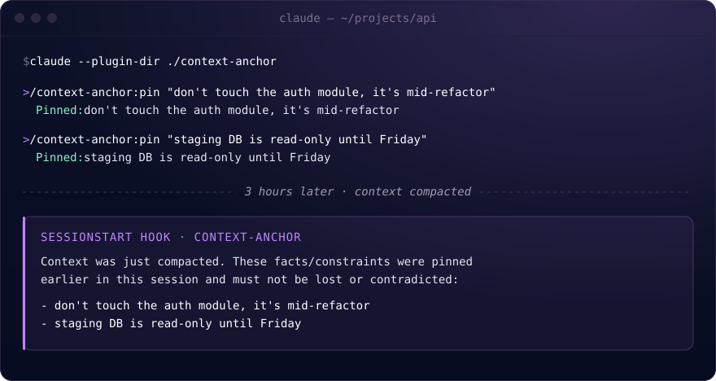
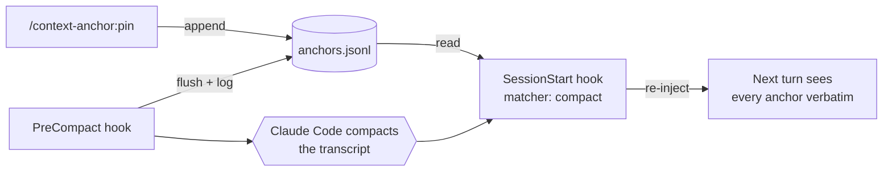

# context-anchor

**A Claude Code plugin that pins facts, decisions and constraints so they survive context compaction in long sessions.**

[](https://docs.claude.com/en/docs/claude-code/plugins) [](.claude-plugin/plugin.json) [](LICENSE)

[Why](#why) · [Install](#install) · [Usage](#usage) · [How it works](#how-it-works) · [Status](#status)



## Why

When a Claude Code session runs long, the transcript is summarized ("compacted") to stay inside the context window. That's necessary, but summaries are lossy. A constraint stated early on, like *"don't touch the auth module"*, *"the deadline is Friday"* or *"we decided X, not Y"*, can be smoothed over or dropped, and Claude Code has no built-in way to carry it across that boundary verbatim.

context-anchor gives you an explicit way to pin something so it survives compaction intact. Pinned anchors are re-injected on the first turn after compaction, instead of relying on the summary to have kept them.

## Install

There's no marketplace listing yet. Point Claude Code at a local checkout:

```bash
git clone https://github.com/aleksns/context-anchor.git
claude --plugin-dir ./context-anchor
```

## Usage

```
/context-anchor:pin "don't touch the auth module, it's mid-refactor"
/context-anchor:list
/context-anchor:clear
```

| Command | What it does |
|---|---|
| `/context-anchor:pin <text>` | Appends the text word for word, with a timestamp, to the project's anchors file, and replies `Pinned: <text>`. |
| `/context-anchor:list` | Lists pinned anchors, most recent first, with the time each was pinned. |
| `/context-anchor:clear [text or index]` | Removes one anchor. With no argument, asks before clearing everything. |

The skills also respond to plain language, like *"remember this"*, *"pin this"* or *"what's pinned?"*.

## How it works



- **`pin` skill:** writes `{"text", "pinned_at"}` as one JSON line to `.claude/context-anchor/anchors.jsonl`. It trims filler words, never the meaning.
- **`PreCompact` hook:** fires right before compaction. It makes sure the anchors file is flushed to disk and logs the event to `.claude/context-anchor/compactions.log`.
- **`SessionStart` hook** (matcher `compact`): fires when the session resumes after compaction. It reads the anchors and re-injects them as a reminder, so they're back in view on the very next turn.

| File | Contents |
|---|---|
| `.claude/context-anchor/anchors.jsonl` | One pinned anchor per line |
| `.claude/context-anchor/compactions.log` | `<timestamp> compaction trigger=<trigger> anchors=<count>` |

Anchors are scoped to the project directory (`CLAUDE_PROJECT_DIR`), not to a single session. v1 assumes one active session per project at a time.

## Status

**v1:** manual pinning only. There's no automatic "this seems important" detection; that's a fuzzier problem and deliberately out of scope for now.

**Tested at the script level:** each hook script has been fed the JSON it receives on stdin, and its output checked for well-formedness. It has **not yet been verified against a real `/compact` in a live session**. That's the next thing to confirm.

<details>
<summary><strong>Known uncertainty: which field SessionStart reads</strong></summary>

<br>

Claude Code's hook documentation is inconsistent about which JSON field a `SessionStart` hook can use to inject text back into the conversation. `additionalContext` is confirmed for `PreToolUse`, but it's undocumented whether `SessionStart` honors the same field, `systemMessage`, or both.

`inject-anchors.sh` emits the same message under `systemMessage`, top-level `additionalContext` and `hookSpecificOutput.additionalContext` at once, so it keeps working whichever one Claude Code actually reads.

</details>

## Development

```bash
claude --plugin-dir /path/to/context-anchor
```

Hook changes need a session restart (`/reload-plugins` doesn't reload hooks). Skill changes are picked up by `/reload-plugins`.

```
.claude-plugin/plugin.json    plugin manifest
hooks/hooks.json              PreCompact and SessionStart registration
scripts/snapshot-anchors.sh   PreCompact: flush and log
scripts/inject-anchors.sh     SessionStart: re-inject anchors
skills/{pin,list,clear}/      slash commands
```

## License

[MIT](LICENSE) © Aleksandr Nazarov
